# User Manual
# Introduction

This application allows users to perform virtual science experiments in a safe and interactive environment. Each experiment guides the user step-by-step and explains the science behind it.

## How to Start

1. Launch the application

   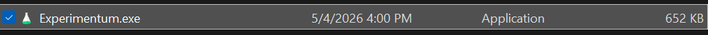
2. (Optional) Register or log in to save your progress

   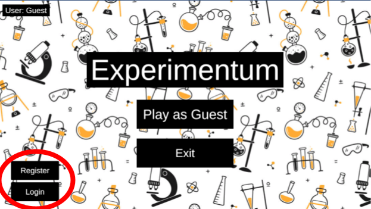
3. Select the available level

   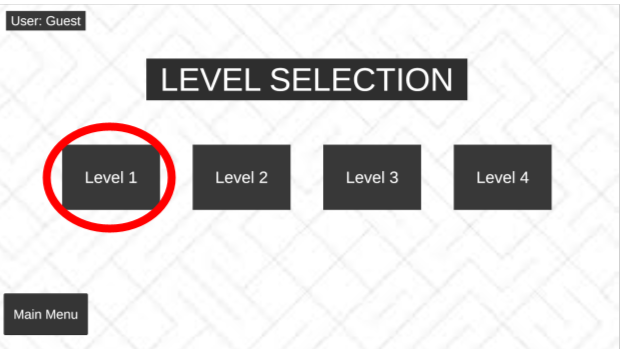
4. Select the available experiment to begin

   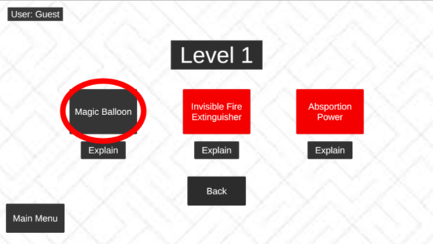

## Gameplay Instructions

* Follow the to-do list on the screen
  
  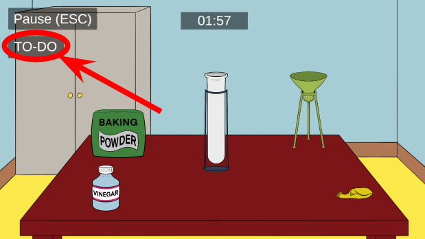
* Complete tasks in the correct order
* Drag and interact with objects to complete each step of the experiment
  
  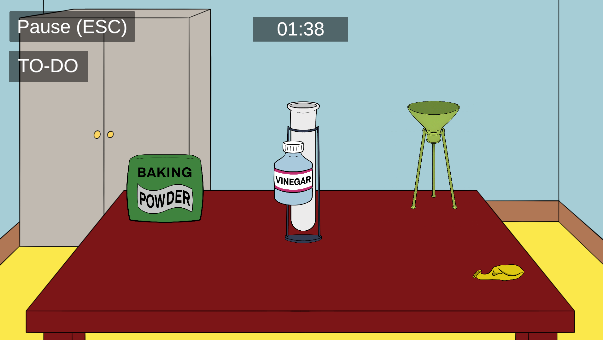

## UI Explanation

* To-Do Panel → Shows the steps required to complete the experiment
  
  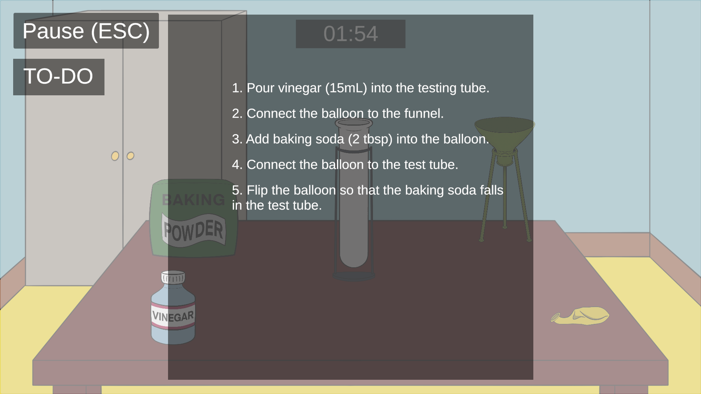
* Timer → Counts down remaining time
  
  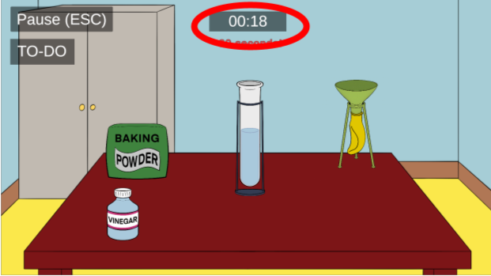
* Penalty Message → Appears when a wrong action is performed
  
  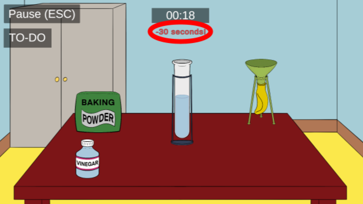
* Task Complete Message → Confirms correct actions
  
  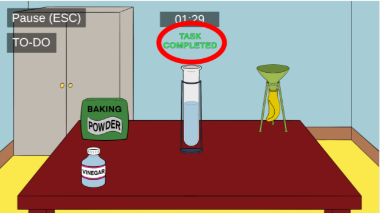
* Pause Menu → Press ESC to pause the game
  
  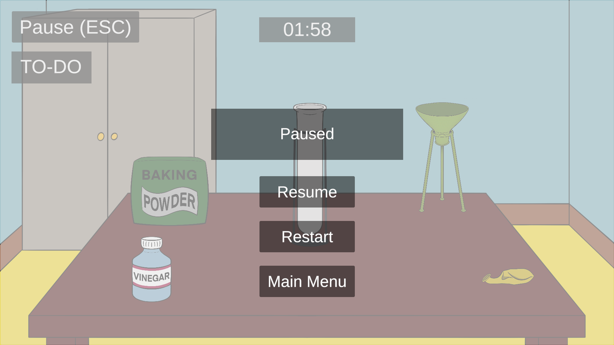

## Completing an Experiment

* Finish all required steps before time runs out
* A success screen and reaction video will play upon completion
  
  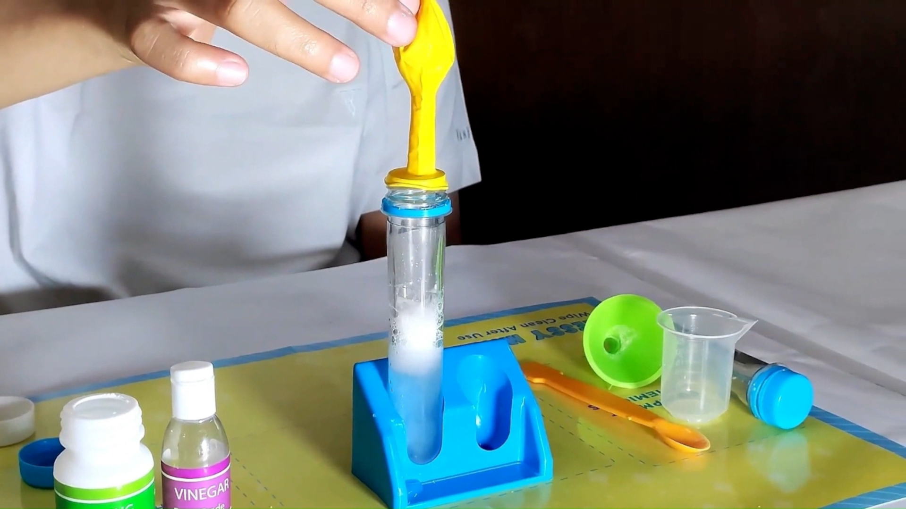
  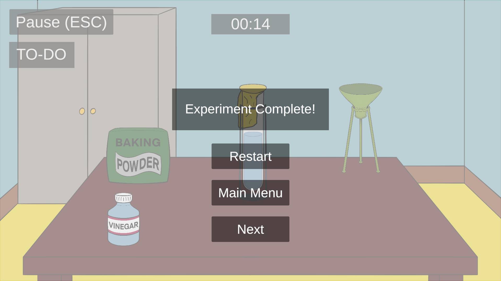

## Failure Conditions

* If time runs out, the experiment fails
* A retry option will be available
  
  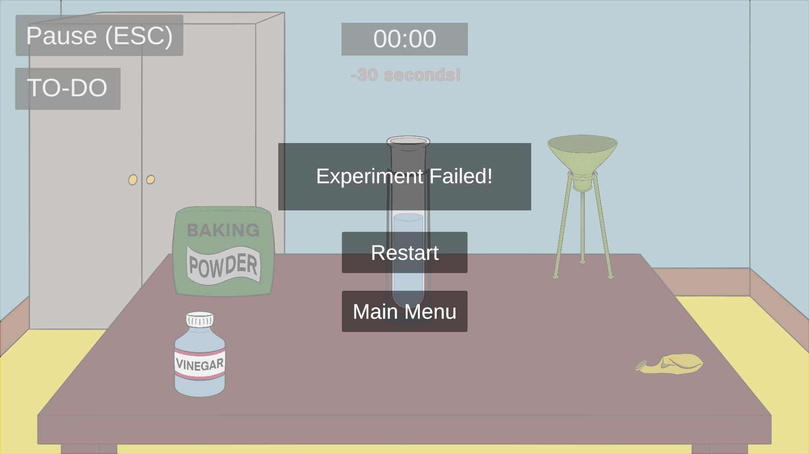

## Saving Progress

* Progress is saved automatically after completing an experiment
* Completed experiments unlock new ones
  
  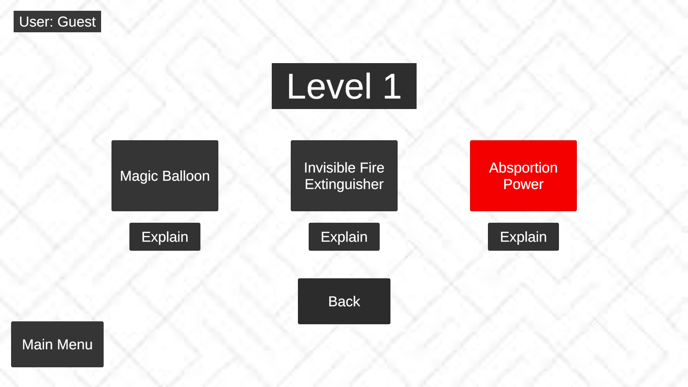

## Troubleshooting

* If objects don’t respond, ensure the game is not paused
* Restart the experiment if unexpected behavior occurs
  
  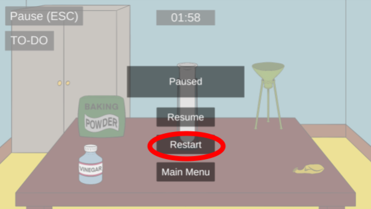
* Remember to log in to continue where you left off